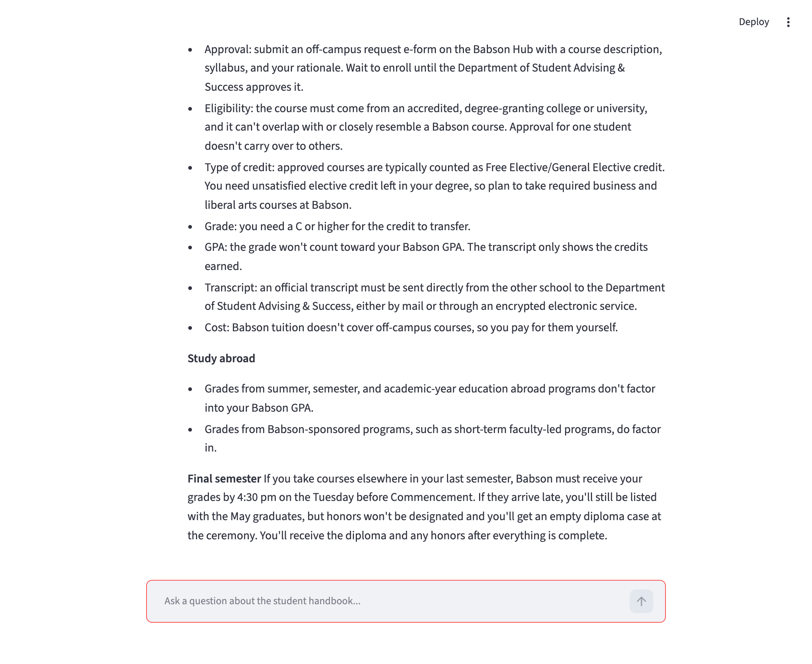
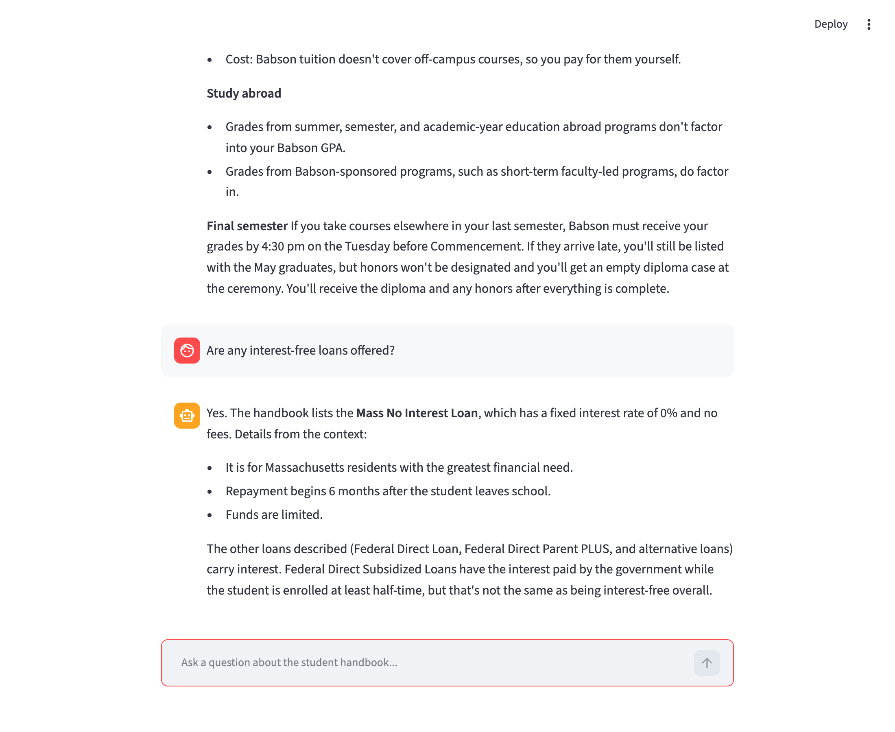
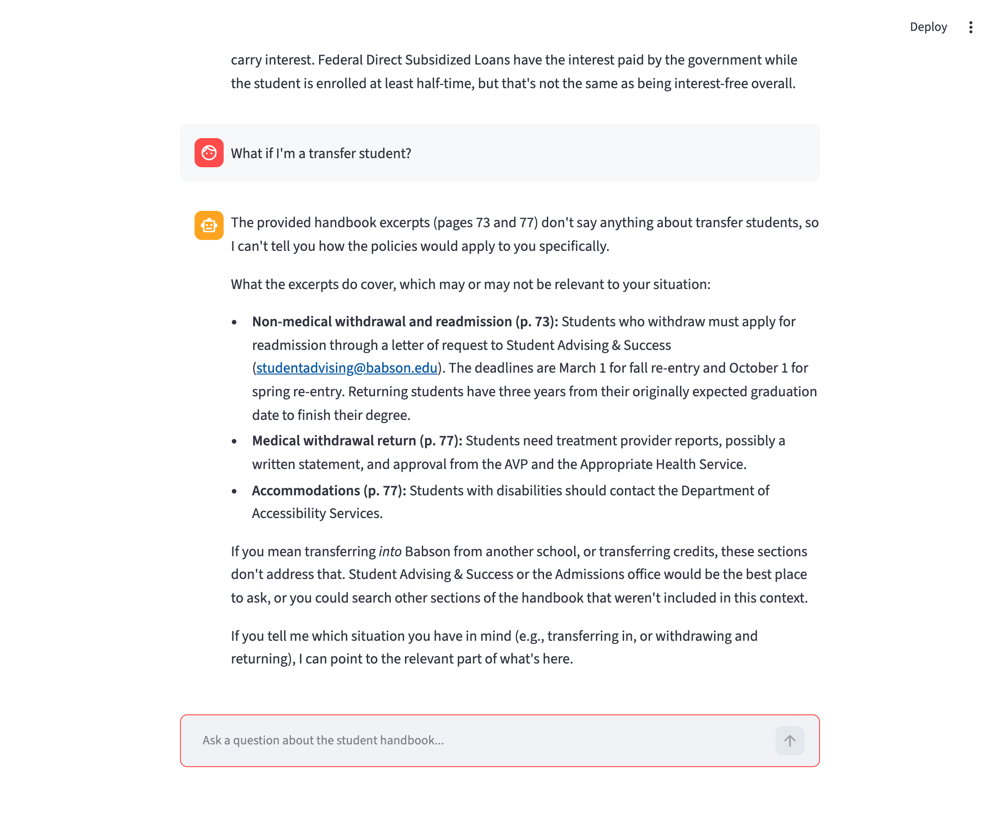
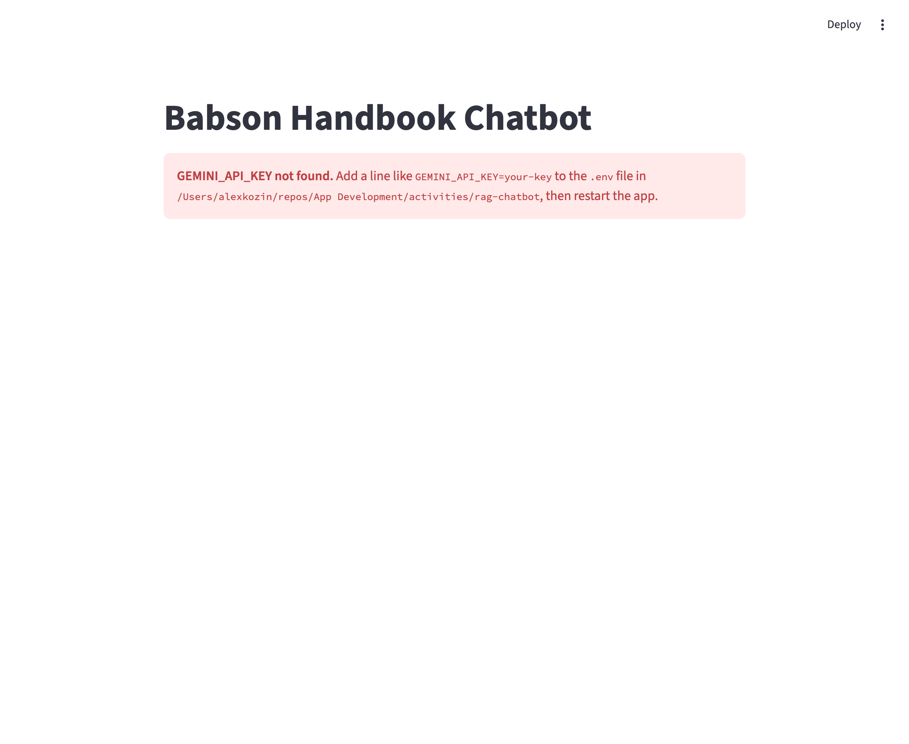
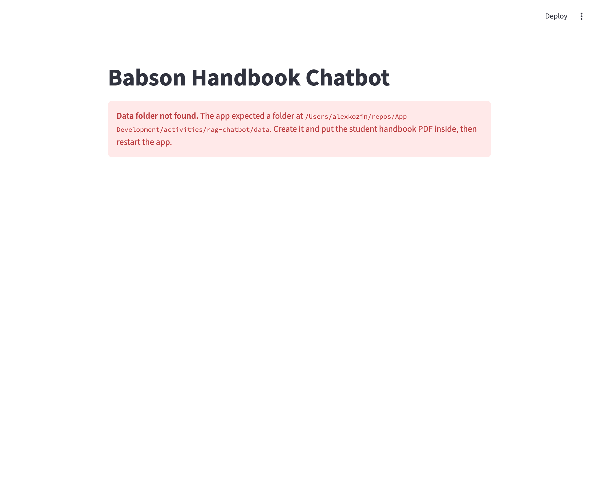
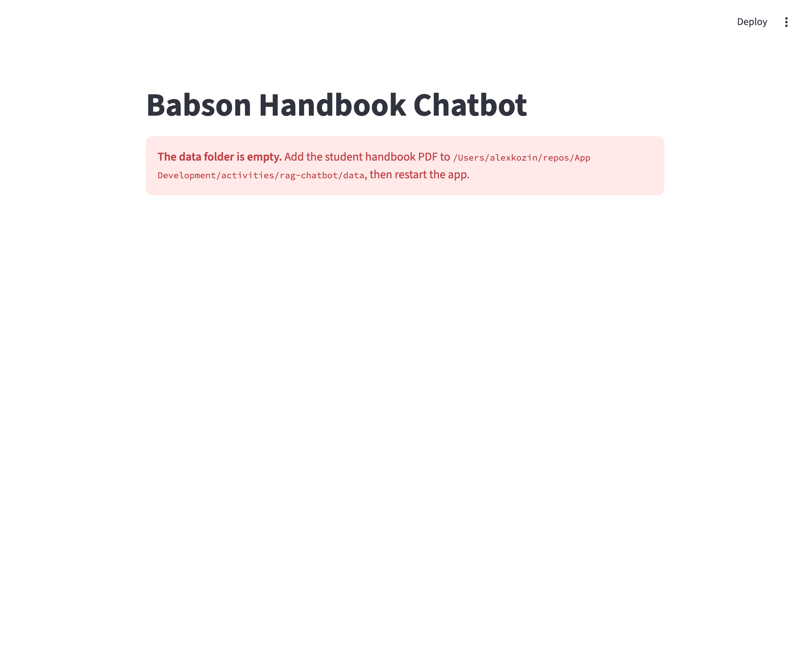
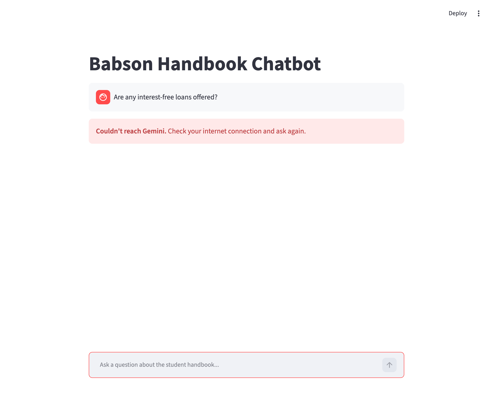
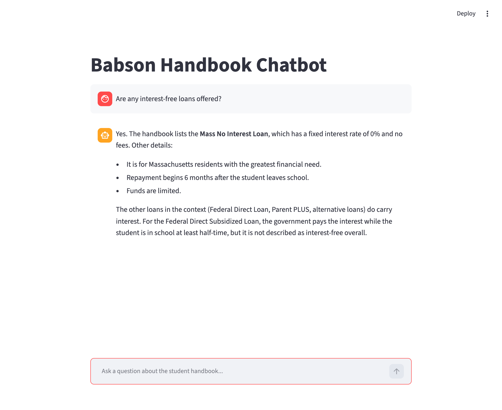

# RAG Chatbot — Babson Student Handbook

In-class Activities 10–11 for OIM 3641. A Streamlit chatbot that answers questions about the
Babson undergraduate student handbook using retrieval-augmented generation (RAG): LlamaIndex
indexes the handbook locally with a HuggingFace embedding model, retrieves the most relevant
passages for each question, and sends them to Gemini to write the answer.

## Run it

```bash
cd activities/rag-chatbot
cp .env.example .env          # then paste your key into .env
uv sync
uv run streamlit run app.py
```

`.env` holds `GEMINI_API_KEY` and is git-ignored. `data/` holds the handbook PDF; everything in
that folder gets indexed.

> **Setup note:** the activity's `uv add` list doesn't include `llama-index-readers-file`. Without
> it, `SimpleDirectoryReader` can't parse PDFs and silently indexes the raw PDF bytes as text, so
> every answer is built from garbage. It's added in `pyproject.toml` here.

## Activity 10 write-up

### How these were tested

No Gemini key is committed (or should be), so for the runs below I swapped Claude in as the LLM
through a small wrapper that calls `claude -p`. The wrapper isn't part of the repo. `app.py` is
unchanged and still uses Gemini; only the final answer-writing call differs. Retrieval, the
handbook index, and the Streamlit UI are exactly what you'd get with a Gemini key. For the
"general chat LLM" comparison I asked Claude the same three questions in one ordinary chat with
no access to the handbook.

### Test queries

| Question | Handbook chatbot (RAG) | General chat LLM (no handbook) |
| --- | --- | --- |
| Can I get credit for courses taken somewhere else? | Babson's actual policy: a cap of 12 credits (pre-Fall 2021) or 16 (Fall 2021 on), approval through an off-campus e-form on the Babson Hub, a C or better, counts as free elective credit, not in the GPA, and a final-semester grade deadline of 4:30 pm on the Tuesday before Commencement. | Generic advice: "most colleges, Babson included" accept C-or-better courses, there's "usually a cap" and a residency requirement, get pre-approval, and confirm with the registrar. No numbers or Babson-specific process. |
| Are any interest-free loans offered? | Yes: the **Mass No Interest Loan**, 0% fixed rate with no fees, for Massachusetts residents with the greatest need, repayment starting 6 months after leaving school. It also explains why subsidized federal loans aren't truly interest-free. | Hedged: truly interest-free loans are "rare". It suggests tuition payment plans, subsidized federal loans, and "some colleges" offering emergency loans, and says to ask Financial Aid. It misses the Mass No Interest Loan entirely. |
| Follow-up: "What if I'm a transfer student?" | Lost the thread. It retrieved unrelated pages (withdrawal and readmission, accommodations), said the excerpts "don't say anything about transfer students," and asked which situation I meant. | Followed the conversation. It tied the follow-up back to both earlier answers: how transfer credit gets evaluated and appealed, and how aid differs for transfers. |

### Observations

- **Specificity:** RAG wins clearly on the factual questions. It quotes Babson's real limits,
  forms, and deadlines and names a loan the general model didn't know about. The general model
  answers from what's typical at colleges and hedges with "confirm with the registrar."
- **Grounding:** the RAG answers cite the handbook (even page numbers) and say when the context
  doesn't cover something, instead of guessing.
- **Conversation:** the general chat handled the follow-up naturally; the handbook bot couldn't,
  because it never saw the earlier questions (see below).

### Does the chatbot have memory?

Not in the way that matters. LLMs are stateless: every API call starts from nothing. Chat
products like ChatGPT or Claude handle the "memory problem" by resending the conversation so far
with every new message, so the model rereads the whole chat each turn. Once a conversation
outgrows the context window, older turns get dropped or compressed into a summary. Some products
also keep a long-term memory store and retrieve relevant notes into the prompt, which is the same
retrieval idea as RAG, applied to your history instead of a document.

This chatbot keeps the chat in `st.session_state`, but only to **redisplay** it. Each call to
`query_engine.query(prompt)` sends just the newest question, so the model never sees the earlier
turns. A follow-up like "What if I'm a transfer student?" gets retrieved and answered as a
standalone question with no idea what "what if" refers to. Real memory would require passing the
history along, for example with LlamaIndex's chat engine (`index.as_chat_engine()`), which rewrites
follow-ups into standalone questions using the history.

### Screenshots

| Credit for outside courses | Interest-free loans | Transfer-student follow-up |
| --- | --- | --- |
|  |  |  |

## Activity 11: Production-ready code

[Changes since the Activity 10 version](https://github.com/akoz2024/AI-DRIVEN-APP-DEVELOPMENT/commits/main/activities/rag-chatbot)

**Refactor:** imports grouped per PEP 8, `DATA_DIR` used everywhere (now a `pathlib.Path`
anchored to `app.py`, so the app works no matter which folder you launch it from), and a
docstring on every function.

**Fix:** `VectorStoreIndex(documents)` → `VectorStoreIndex.from_documents(documents)`. The old
version treated each of the handbook's 103 pages as a single unchunked node; `from_documents`
splits them into 112 chunks before embedding.

**Caching:** `get_query_engine()` is decorated with `@st.cache_resource`, and the `Settings`
lines moved inside it, so the handbook is indexed and the embedding model loaded once, not on
every question. The cached function takes the validated key as an argument and contains no
`st.error`/`st.stop()`.

| Check | What it protects against | Where in your code | Fail fast or fallback? |
| --- | --- | --- | --- |
| API key | Missing, blank, or misnamed `GEMINI_API_KEY` in `.env` | `get_api_key()`, lines 17–26 | Fail fast |
| Data folder exists | `data/` renamed, moved, or never created | `check_data_dir()`, lines 31–36 | Fail fast |
| Data folder has files | Empty `data/` (hidden files like `.DS_Store` are ignored) | `check_data_dir()`, lines 38–45 | Fail fast |
| Invalid API key | Key is present but Gemini rejects it | `try`/`except genai_errors.ClientError`, lines 64–71 | Fail fast |
| Index build fails | Corrupt or unreadable file, embedding model download fails | `except (OSError, ValueError)`, lines 72–78 | Fail fast |
| Anything else at startup | Unexpected errors while building the engine | `except Exception`, lines 79–81 | Fail fast |
| Rate limit | Gemini returns 429 for a question | `except genai_errors.ClientError`, lines 100–104 | Fallback |
| Gemini outage | Gemini returns a 5xx server error | `except genai_errors.ServerError`, lines 105–106 | Fallback |
| No internet | Wi-Fi off or dropped connection while asking | `except httpx.TransportError`, lines 107–108 | Fallback |
| Anything else per question | Unexpected error answering one question | `except Exception`, lines 109–110 | Fallback |

Fallback errors show a message and leave the chat running, so the user can just ask again.

**Stretch goals:** chat history with `st.session_state`/`st.chat_message` and an
`st.spinner("Searching...")` around the query are both in. Persisting the index to disk is not.

### Screenshots

Each test used a freshly restarted app.

**1. `GEMINI_API_KEY` missing from `.env`**



**2. Data folder renamed** (`data/` → `data_renamed/`)



**3. Data folder emptied** (only a hidden `.DS_Store` left, which the check ignores)



**4. No internet while asking a question.** The wrapper raised the same `httpx.ConnectError` the
Gemini client throws when Wi-Fi is off. The app shows the message and stays usable.



**Working normally** after the revisions:


